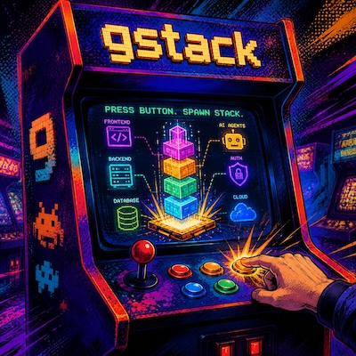

# gstack for Augment Code — v2

A high-fidelity port of [Garry Tan's gstack](https://github.com/garrytan/gstack) as Augment custom commands. Every command takes a **Jira key** as its parameter, reads/writes a local feature folder `.augment/features/<KEY>/`, and is designed **automation-first** so the whole stack runs under cron via `auggie`.

v2 replaces the first port with much deeper methodology: the scoring rubrics, severity taxonomies, gates, anti-skip rules, and voice of the original skills — adapted for Auggie (no browser binary, no Claude-Code hooks, Jira instead of plan files).



---

## Install

**User-level** (all projects):
```bash
cp -r gstack ~/.augment/commands/
```

**Workspace-level** (one project, shareable with the team):
```bash
cp -r gstack /path/to/project/.augment/commands/
```

Windows (PowerShell): `Copy-Item -Recurse gstack "$env:USERPROFILE\.augment\commands\"`

**Guidelines (AGENTS.md):** this file is NOT a command and must stay out of the commands folder — anything in `.augment/commands/gstack/` becomes a slash command. Instead, copy it into the target project's root as `AGENTS.md` (or merge its sections into an existing one). Auggie reads it as workspace guidelines, which is what makes the feature-folder awareness, voice, and routing rules apply to every session — not just when a gstack command runs:
```bash
cp AGENTS.md /path/to/project/AGENTS.md   # or append to the existing file
```

Add to the target project's `.gitignore`:
```
.augment/features/
.augment/freeze-dir.txt
.augment/confluence-parent.txt
```

Verify: `auggie command list` → expect `gstack:office-hours`, `gstack:spec`, `gstack:plan-ceo-review`, `gstack:plan-eng-review`, `gstack:plan-design-review`, `gstack:plan-devex-review`, `gstack:autoplan`, `gstack:review`, `gstack:investigate`, `gstack:qa`, `gstack:qa-only`, `gstack:cso`, `gstack:devex-review`, `gstack:learn`, `gstack:ship`, `gstack:document-release`, `gstack:document-generate`, `gstack:retro`, `gstack:document`, `gstack:context-save`, `gstack:context-restore`, `gstack:careful`, `gstack:freeze`, `gstack:guard`, `gstack:unfreeze`.

---

## How it works

Every command writes a structured artifact to `.augment/features/<JIRA-KEY>/`. Commands are independent — run them in any order — and each reads whatever already exists in the folder. Findings compound: an unresolved critical from `review.md` stays alive in `qa` and gates `ship`.

```
.augment/features/JIRA-999/
├── office-hours.md        design doc (office-hours)
├── spec.md                backlog-ready spec (spec)
├── plan-ceo-review.md     scope + 11-section review (plan-ceo-review)
├── plan-eng-review.md     architecture + findings (plan-eng-review)
├── test-plan.md           consumed by qa (plan-eng-review)
├── plan-design-review.md  7-pass design review (plan-design-review)
├── plan-devex-review.md   DX plan review (plan-devex-review)
├── autoplan.md            pipeline gate package (autoplan)
├── review.md              diff review, ship gate (review)
├── investigate.md         appended per investigation (investigate)
├── qa-report.md + qa-baseline.json    (qa / qa-only)
├── cso-report.md          security audit (cso)
├── devex-report.md        measured DX audit (devex-review)
├── ship.md                ship record (ship)
├── document-release.md    doc sync record (document-release)
├── retro.md               retrospective (retro)
└── context.md             session checkpoint (context-save/restore)
```

Project-level (not per-ticket): `.augment/learnings.md` (gstack:learn).

`gstack:document` reads the whole folder and upserts ONE Confluence page per feature — the only command that writes outside the repo.

---

## Automation contract (what makes v2 cron-able)

Every command runs to completion without waiting for input. At a decision gate:

- **Interactive session + high-stakes decision** (irreversible, scope-changing) → it asks, one issue per question, with a recommendation and why.
- **Unattended** (cron, `auggie --print`, or `auto` appended to the arguments) → it takes the documented default and records every choice in a `## Decisions made without you` section, plus `## Open questions` for what genuinely needs you.

Never done unattended: expanding/cutting scope silently, posting to Jira/Confluence, destructive git operations, deciding User Challenges (when the review concludes your stated direction itself should change).

Two commands lean interactive by design: `office-hours` (the forcing questions ARE the value — unattended it produces a clearly-marked hypothesis doc) and `spec` (unattended it marks answers EVIDENCED/ASSUMED and emits `DRAFT-UNVALIDATED`).

### Cron examples

```bash
# Nightly: pre-bake the hypothesis design doc + spec for tomorrow's ticket
auggie --print "command gstack:office-hours JIRA-999 auto"
auggie --print "command gstack:spec JIRA-999 auto"

# Nightly: full review pipeline on the current branch's ticket
auggie --print "command gstack:autoplan JIRA-999"

# Weekly: deep security audit + DX regression check + team retro
auggie --print "command gstack:cso JIRA-000 --comprehensive"
auggie --print "command gstack:devex-review JIRA-000"
auggie --print "command gstack:retro JIRA-000 --window 7d"
```

(Adjust invocation syntax to your auggie version — `auggie command <name> <args>` also works.)

---

## Command reference

### Planning (fetch Jira at start)

| Command | What it does |
|---------|-------------|
| `/gstack:office-hours <KEY>` | YC office hours: six forcing questions, premise challenge, alternatives → design doc. |
| `/gstack:spec <KEY>` | Principal-engineer interrogation → backlog-ready spec, zero design decisions left. |
| `/gstack:plan-ceo-review <KEY>` | Scope modes, premise challenge, 11-section deep review, failure-mode registries. |
| `/gstack:plan-eng-review <KEY>` | Scope challenge, architecture, full test tracing + coverage diagram → `test-plan.md`. |
| `/gstack:plan-design-review <KEY>` | 7 design passes, 0-10 ratings, AI-slop blacklist, state coverage. |
| `/gstack:plan-devex-review <KEY>` | 8 DX passes, persona, TTHW tiers, developer journey map. |
| `/gstack:autoplan <KEY>` | Whole pipeline (CEO → Design → Eng → DX) with principled auto-decisions + one final gate. |

### Implementation (Jira key as label)

| Command | What it does |
|---------|-------------|
| `/gstack:review <KEY>` | Staff-engineer diff review: critical pass, specialists, red team, fix-first. |
| `/gstack:investigate <KEY> <symptom>` | Root-cause debugging. Iron Law: no fix without confirmed cause. 3-strike rule. |
| `/gstack:qa <KEY>` | Test → fix → verify against `test-plan.md`. Health score, regression baseline. |
| `/gstack:qa-only <KEY>` | Same QA, report-only — changes nothing, writes repro tests only. |
| `/gstack:cso <KEY>` | Security audit: attack surface, secrets archaeology, OWASP Top 10, STRIDE, 8/10 confidence gate. |
| `/gstack:devex-review <KEY>` | Measured DX audit: hello-world run timed, error gallery, boomerang comparison. |
| `/gstack:learn [add\|show\|search\|prune]` | Project learnings that compound across tickets. |

### Shipping & docs

| Command | What it does |
|---------|-------------|
| `/gstack:ship <KEY>` | Gates → merge base → tests → coverage audit → plan completion → bisectable commits → PR. |
| `/gstack:document-release <KEY>` | Post-ship doc sync: Diataxis coverage map, per-file audit, CHANGELOG voice. |
| `/gstack:document-generate <KEY> <mode> <topic>` | Generate a missing doc in one Diataxis mode. |
| `/gstack:retro <KEY> [--window 7d]` | Git-history retro: metrics, sessions, hotspots, plan-vs-reality, per-person feedback. |
| `/gstack:document <KEY>` | Synthesize the feature folder → upsert ONE Confluence page. |

### Session & safety (no Jira fetch)

| Command | What it does |
|---------|-------------|
| `/gstack:context-save <KEY>` / `context-restore <KEY>` | Lossless session checkpoint / resume. |
| `/gstack:careful` | Confirm before destructive commands. |
| `/gstack:freeze <path>` / `unfreeze` | Lock / unlock edits to one directory. |
| `/gstack:guard <path>` | careful + freeze combined. |

---

## Jira & Confluence integration

Planning commands (office-hours, spec, plan-*-review, autoplan) fetch the Jira issue at the start: description, acceptance criteria, comments, links. All other commands use the key as label and folder name only.

**Nothing is ever posted to Jira automatically.** `spec` may offer (interactive, explicit yes only) to post the finished spec to the ticket. The Confluence page is the only other external write, and only when you run `gstack:document`.

---

## Typical sprint

```bash
auggie command gstack:office-hours JIRA-999      # frame it
auggie command gstack:autoplan JIRA-999          # full review pipeline (or the plan-* commands individually)
# ... build ...
auggie command gstack:review JIRA-999            # pre-landing review
auggie command gstack:qa JIRA-999                # test → fix → verify
auggie command gstack:ship JIRA-999              # gates, commits, PR
auggie command gstack:document JIRA-999          # Confluence page
auggie command gstack:retro JIRA-999             # what we learned
```

---

## What is NOT ported

Browser/binary-dependent gstack skills can't run as Augment commands: `/browse`, live browser `/qa`, `/design-shotgun`, `/design-html`, `/design-consultation`, `/design-review` (visual), `/benchmark`, `/canary`, `/land-and-deploy`, `/pair-agent`, `/codex`, `/open-gstack-browser`. Where the originals used Codex or visual mockups, v2 substitutes fresh-context subagents / adversarial self-passes and HTML wireframe sketches.

## License

MIT. Credits: original gstack by [Garry Tan](https://github.com/garrytan/gstack).
